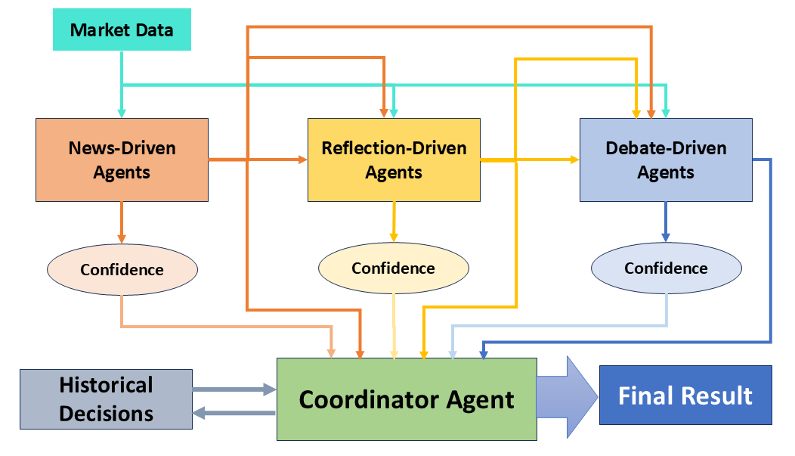
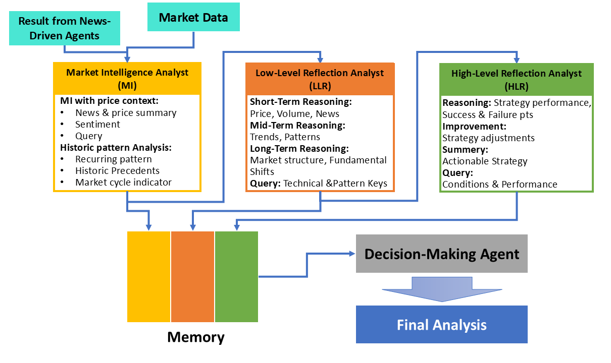
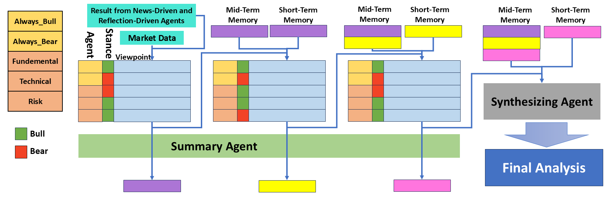

# Multi-Agent Quants 🤖📈


A sophisticated multi-agent trading system that enhances financial market predictions using specialized AI agents powered by Large Language Models (LLMs).

## Live Demo

Access the deployed version at: [Multi-Agent Quants Web App](https://multi-agent-quants.streamlit.app/)

## Features

- Modern web interface with real-time stock price charts
- Interactive configuration settings
- Live agent analysis updates
- Customizable trading parameters

## System Architecture



Our system comprises four specialized agents, each with distinct responsibilities:

### 1. News-Driven Agent
- Retrieves and processes data from diverse sources
- Employs concurrent processing for efficient data retrieval

### 2. Reflection-Driven Agent


Implements a three-tiered reasoning framework:

1. **Market Intelligence (MI)**
   - Integrates price context and historical patterns
   - Correlates current movements with longer-term trends
   - Establishes baseline analysis

2. **Low-Level Reflection (LLR)**
   - Re-evaluates patterns using technical indicators
   - Performs granular market signal analysis
   - Updates assumptions through iterative reflection

3. **High-Level Reflection (HLR)**
   - Examines cyclical patterns
   - Evaluates long-term implications
   - Synthesizes strategic lessons

### 3. Debate-Driven Agent


Simulates structured debates between two types of agents:

**Extreme Agents:**
- Always Bull: Maintains optimistic stance
- Always Bear: Maintains pessimistic stance

**Expert Agents:**
- Fundamental Analyst: Evaluates macroeconomic conditions
- Technical Analyst: Assesses price patterns
- Risk Analyst: Focuses on uncertainties

Implements a two-layer memory system:
- Short-term Memory: Retains current round summaries
- Mid-term Memory: Accumulates historical context

### 4. Coordinator Agent
Orchestrates the entire system through:

1. **Dynamic Weight Adjustment**
   - Considers agent confidence scores
   - Evaluates historical performance
   - Adapts to market context

2. **Decision Synthesis**
   - Weighted aggregation of agent signals
   - Prompt-driven refinement
   - Comprehensive output including:
     - Decision summary
     - Risk management strategy
     - Symbol-specific signals

## Local Setup

1. Clone the repository:
```bash
git clone https://github.com/ZhengxuYan/Multi-Agent-Quants.git
cd Multi-Agent-Quants
```

2. Create and activate a virtual environment:
```bash
python -m venv venv
source venv/bin/activate  # On Unix/macOS
# OR
.\venv\Scripts\activate  # On Windows
```

3. Install dependencies:
```bash
pip install -r requirements.txt
```

4. Run the application:
```bash
python -m streamlit run app.py
```

5. Open your browser and navigate to:
```
http://localhost:8501
```

## Usage

1. Enter your OpenAI API key in the sidebar
2. Configure model settings for each agent:
   - Model selection (GPT-3.5, GPT-4)
   - Temperature
   - Max tokens
3. Adjust trading settings:
   - Analysis timeframe
   - Risk tolerance
   - News sources
4. Select stocks to analyze (up to 5)
5. Click "Run Analysis" to start the analysis

## Project Structure

```
Multi-Agent-Quants/
├── agents/
│   ├── __init__.py
│   ├── news_agent.py
│   ├── reflection_agent.py
│   ├── debate_agent.py
│   └── coordinator_agent.py
├── config.py
├── main.py
├── app.py
├── evaluation.py
├── utils.py
└── requirements.txt
```

## Configuration

All settings can be adjusted through the web interface:
- Model parameters for each agent
- Trading timeframes and risk tolerance
- News sources for analysis
- Stock symbol selection

## Requirements

- Python 3.10
- OpenAI API key
- Required packages listed in requirements.txt

## Contributing

Feel free to submit issues, fork the repository, and create pull requests for any improvements.